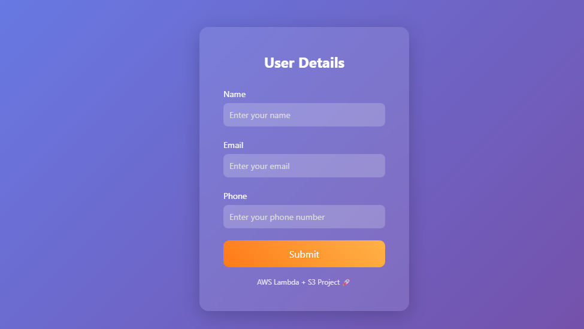
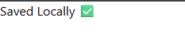
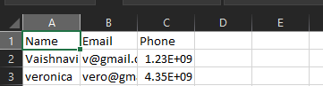
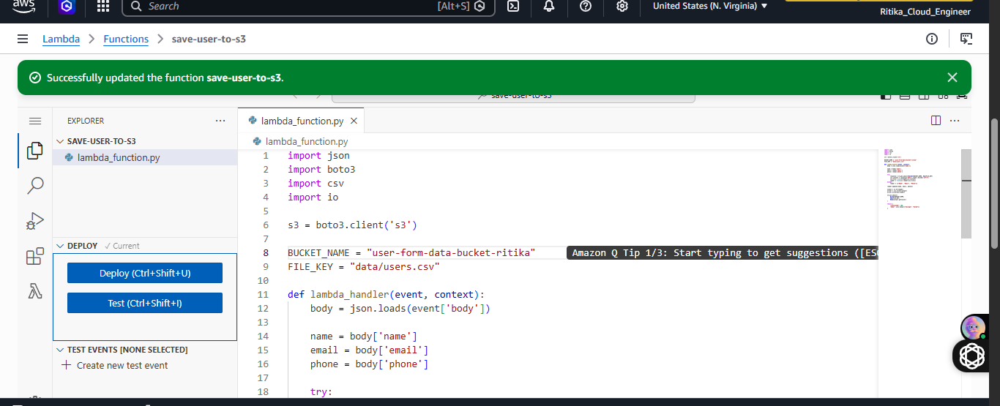

# 🚀 Form to S3 using AWS Lambda (Serverless Project)

## 📌 Overview

This project demonstrates a **serverless data pipeline** where user details submitted through a web form are processed by **AWS Lambda** and stored in an **Amazon S3 bucket as a CSV file**.

---

## 📸 Application Screenshots

### 📝 User Form UI

<p align="center">
  
</p>
<p align="center">
  
</p>
<p align="center">
  
</p>
<p align="center">
  
</p>
---

## 🧠 Architecture

```text
User (Browser Form)
        ↓
Flask App (Local)
        ↓
AWS Lambda (Function URL)
        ↓
Amazon S3 (CSV Storage)
```

---

## ⚙️ Features

* 📄 User form with Name, Email, Phone
* 🔁 Environment-based switching:

  * Local → Save to CSV
  * Production → Send to AWS Lambda
* ☁️ Serverless backend using AWS Lambda
* 🪣 Data stored in S3 as CSV (row-wise append)

---

## 🛠️ Tech Stack

* **Frontend**: HTML, CSS
* **Backend**: Python (Flask)
* **Cloud**: AWS Lambda, Amazon S3

---

## 📁 Project Structure

```text
project/
│
├── app.py
├── templates/
│   └── form.html
├── images/
│   └── form.png   
└── lambda/
    └── lambda_function.py
```

---

## 🚀 Run Locally

```bash
python app.py
```

Open:

```
http://127.0.0.1:5000
```

---

## ☁️ AWS Flow

* Form submit → Lambda triggered
* Lambda → updates CSV in S3

---

## 🎯 Learning Outcomes

* AWS Lambda basics
* S3 integration
* Serverless architecture

---

## 🙌 Author

**Ritika Garg**
